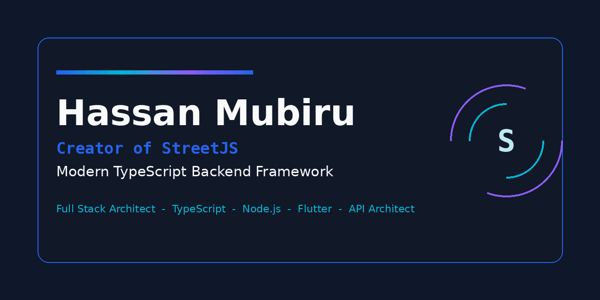

<!-- Profile README for hassanmubiru/hassanmubiru -->

# Hassan Mubiru

Building modern backend infrastructure and developer tools.

---

### 🔭 Currently

Building **StreetJS** — a modern, type-safe TypeScript backend framework for Node.js.

### 🏆 Hackathons

Winner — **Celo** & **Base** ecosystem hackathons. Building in Web3 with TypeScript and Solidity.

### 📌 Projects

- **[StreetJS](https://github.com/hassanmubiru/StreetJS)** — Modern TypeScript backend framework.
- **[Vibra](https://github.com/hassanmubiru/Vibra)** — Real-time social platform.
- **[Afrchat](https://github.com/hassanmubiru/Afrchat)** — Real-time community messaging.
- **[SCMINER](https://github.com/hassanmubiru/SCMINER)** — Data-mining toolkit.

### 🔗 Links

[StreetJS](https://github.com/hassanmubiru/StreetJS) · [GitHub](https://github.com/hassanmubiru) · [LinkedIn](https://www.linkedin.com/in/hassanmubiru)
